<div align="center">


# Teampass

### Self-hosted password management your whole team can trust

Folder-level access control · authenticated AES-256-GCM encryption · compliance evidence<br />
**Your secrets never leave your infrastructure.**

**🌐 [teampass.net](https://teampass.net)** ·
**📖 [Documentation](https://documentation.teampass.net)** ·
**💬 [Discussions](https://github.com/nilsteampassnet/TeamPass/discussions)** ·
**🐳 [Docker Hub](https://hub.docker.com/r/teampass/teampass)**

<br />

[](https://github.com/nilsteampassnet/TeamPass/releases/latest)
[](LICENSE.md)
[](https://www.php.net/)
[](https://hub.docker.com/r/teampass/teampass)
[](https://github.com/nilsteampassnet/TeamPass)

[](https://github.com/nilsteampassnet/TeamPass/actions/workflows/codeql.yml)
[](https://github.com/nilsteampassnet/TeamPass/actions/workflows/docker-publish.yml)
[](https://github.com/nilsteampassnet/TeamPass/security/advisories)
[](https://github.com/sponsors/nilsteampassnet)

</div>

---

## Contents

- [About](#about)
- [Who it's for](#who-its-for)
- [Security](#security)
- [Features](#features)
- [Get started](#get-started)
- [Documentation](#documentation)
- [Languages](#languages)
- [Community](#community)
- [Support Teampass](#support-teampass)
- [License](#license)

---

## About

**Teampass is an open-source credential vault you run yourself.** No account to create, no company behind the curtain holding your data — just a PHP/MySQL application on your own server, with folder-level access control, per-user encryption keys and a full audit trail.

It has been built and maintained since 2009, driven by what real teams actually run into: who should see which credential, how to prove it to an auditor, and how to stop passwords living in chat threads and spreadsheets.

<div align="center">
  
</div>

<details>
<summary><b>📸 More screenshots</b></summary>
<br />

**Items and secrets**

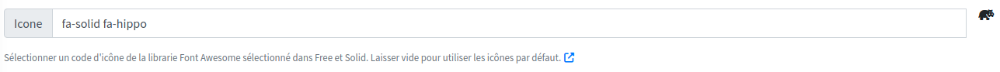
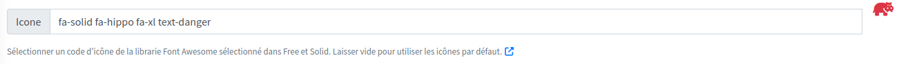

**Folders and roles**

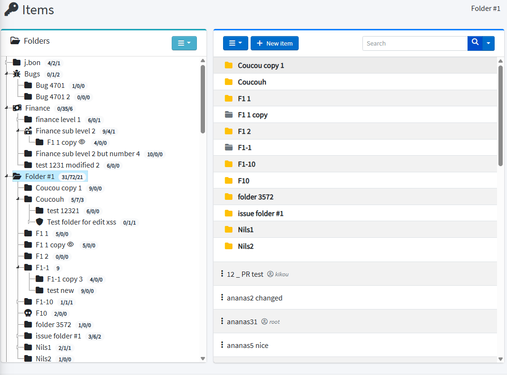
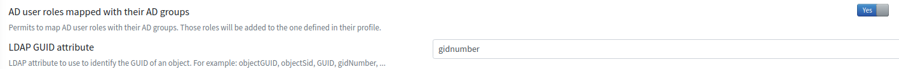
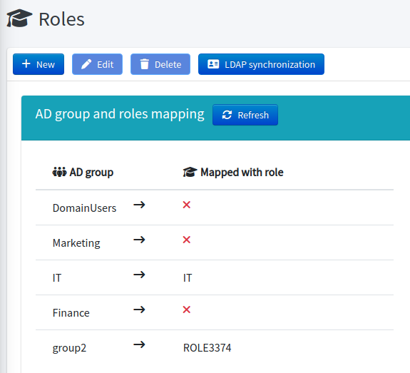
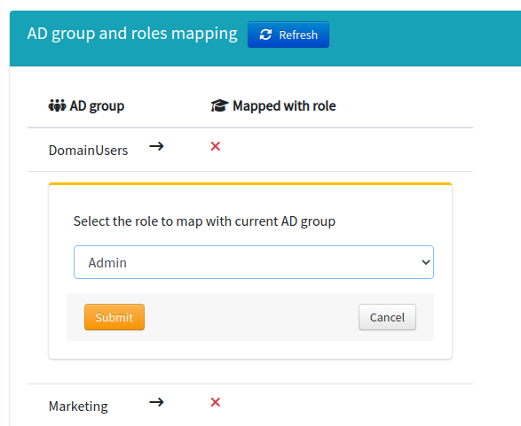

**Authentication and MFA**

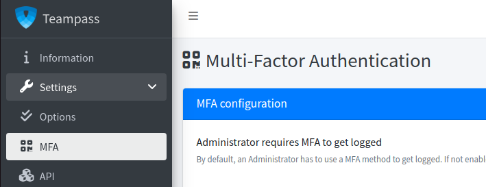
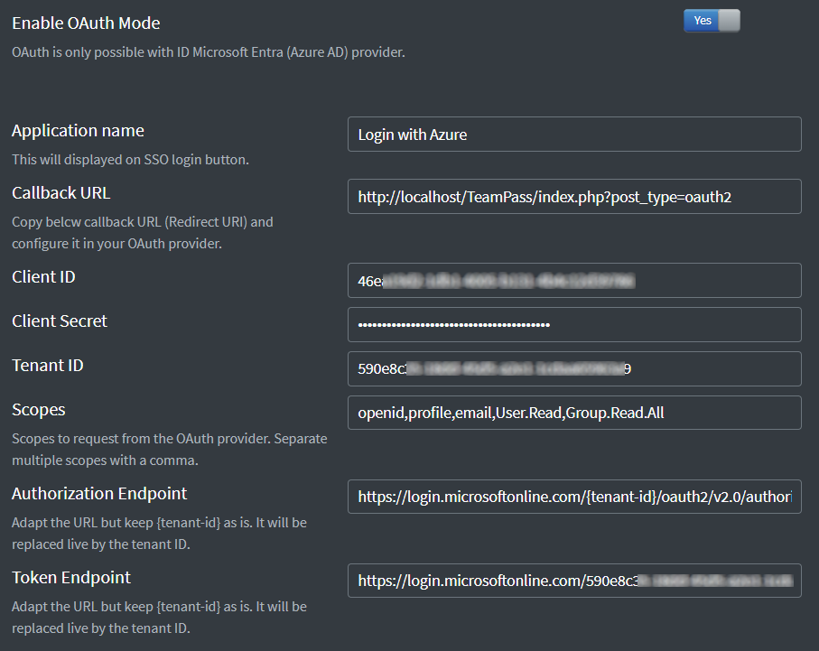

**Encryption keys**

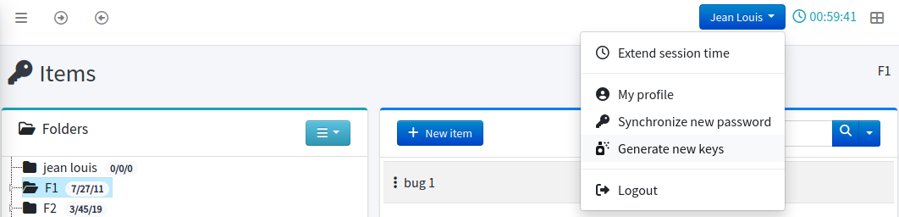
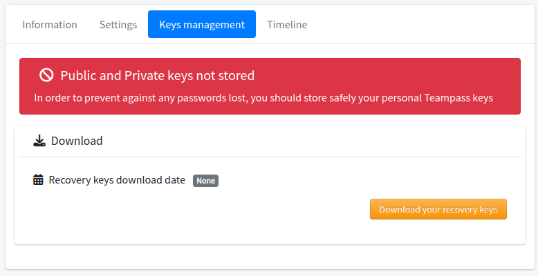

**Search, export, one-time view**

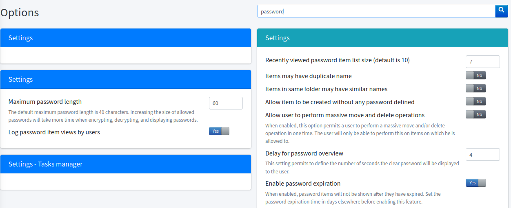
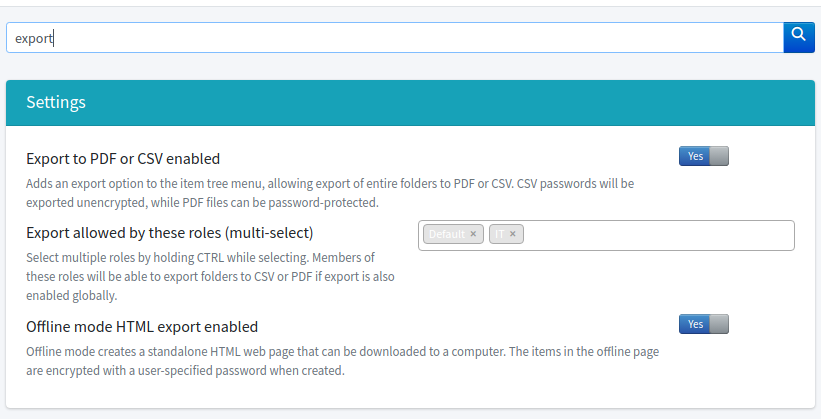
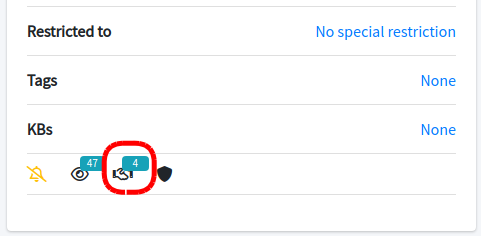
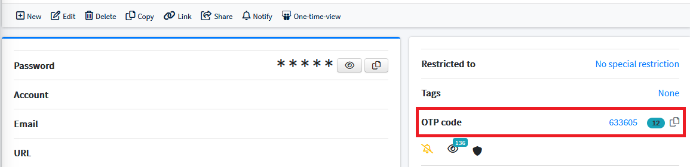

**Background tasks**

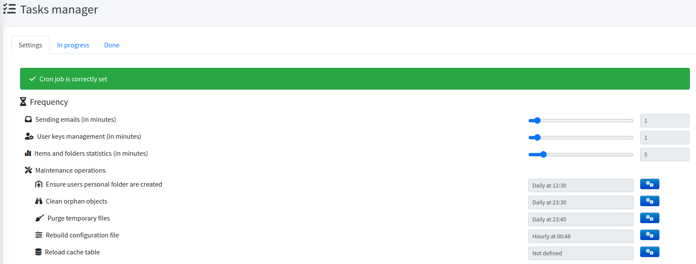
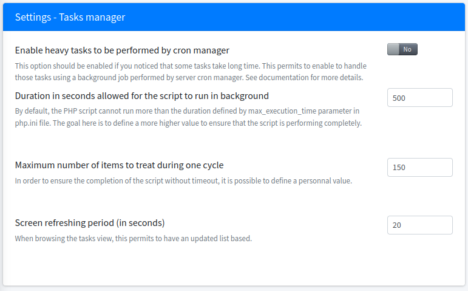

</details>

---

## Who it's for

<table>
<tr>
<td width="33%" valign="top">

### 🏠 Individuals & Homelab

***Own your vault, literally.***

- Runs on a Raspberry Pi or a €5 VPS
- Personal folders encrypted with your own key
- Import from Bitwarden, LastPass, 1Password or KeePassXC
- Free forever, no sign-up required

</td>
<td width="33%" valign="top">

### 👥 Teams & SMB

***Stop sharing passwords in chat.***

- Folders and roles instead of a shared document
- A record of who accessed what, and when
- Secure Send for clients and contractors
- Browser extension for day-to-day autofill

</td>
<td width="33%" valign="top">

### 🏛️ Enterprise & Regulated

***Prove your access controls, don't just claim them.***

- Access recertification campaigns with immutable decisions
- Compliance reports and evidence export
- LDAP/AD with nested groups, OAuth2 SSO
- Data classification and ownership

</td>
</tr>
</table>

---

## Security

### Encryption you can describe to an auditor

Secrets are encrypted with **AES-256-GCM** using random nonces and per-secret salts, under **256-bit object keys**. The private key that unlocks them is derived from your password with **PBKDF2-SHA256 at 600 000 iterations**.

- **Authenticated encryption** — tampering is detected, not silently decrypted - **Per-user key distribution** — every user holds their own RSA-wrapped copy of each object key, so removing an account actually revokes access instead of just hiding a button
- **Lazy migration** — format upgrades happen on access, with no maintenance window

<div align="center">
  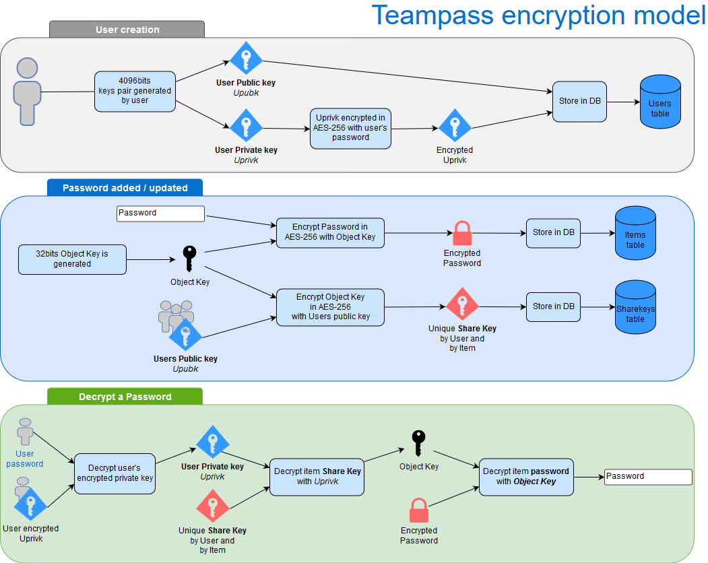
</div>

### Transparency over silence

> A password manager that reports no vulnerabilities is not a password manager that has none.

Findings are triaged, fixed and published as GitHub Security Advisories with CVE identifiers.

- 🔒 [Security policy and how to report](SECURITY.md)
- 📋 [Published advisories](https://github.com/nilsteampassnet/TeamPass/security/advisories)
- 🛡️ [Security hardening guide](https://documentation.teampass.net/#/install/security-hardening)

**Found a vulnerability?** Please report it privately through [GitHub Security Advisories](https://github.com/nilsteampassnet/TeamPass/security/advisories/new) — never in a public issue.

---

## Features

<details>
<summary><b>🗂️ Folder and role access control</b></summary>
<br />

- [Folders](https://documentation.teampass.net/#/features/folders) — unlimited nesting, per-folder password complexity rules
- [Roles](https://documentation.teampass.net/#/features/roles) — grant access by role, not user by user
- [Rights](https://documentation.teampass.net/#/features/rights) — read, write, no-edit, no-delete, resolved least-permissive-wins
- [Users](https://documentation.teampass.net/#/features/users) — per-user overrides on top of roles
- Personal folders that nobody else can read, including administrators

</details>

<details>
<summary><b>🔐 Authenticated encryption</b></summary>
<br />

- [Encryption model](https://documentation.teampass.net/#/install/encryption) — how keys are derived, wrapped and distributed
- [Encryption improvements](https://documentation.teampass.net/#/install/encryption-improvements) — the AES-256-GCM format and its lazy migration
- [Key management](https://documentation.teampass.net/#/features/keys) — regeneration, recovery, per-user key repair

</details>

<details>
<summary><b>📊 Security posture</b></summary>
<br />

- Security Posture Dashboard scoring weak, reused and breached credentials
- [Breach detection](https://documentation.teampass.net/#/features/breach-detection) — Have I Been Pwned checks without sending your passwords
- [Password renewal](https://documentation.teampass.net/#/features/renewal) — expiry policies and reminders
- [Micro-learning](https://documentation.teampass.net/#/features/micro-learning) — in-app nudges instead of a yearly slideshow

</details>

<details>
<summary><b>🏛️ Governance and audit</b></summary>
<br />

- [Access reviews](https://documentation.teampass.net/#/manage/access-reviews) — recertification campaigns with immutable decisions
- [Compliance reports](https://documentation.teampass.net/#/manage/compliance-reports) — evidence you can hand to an auditor
- [Rotation tracking](https://documentation.teampass.net/#/manage/rotation-tracking) — what was rotated, when, by whom
- [Leaver risk](https://documentation.teampass.net/#/features/leaver-risk) — what a departing user could still know
- [Data classification](https://documentation.teampass.net/#/features/classification) — ownership and sensitivity labels

</details>

<details>
<summary><b>🪪 Identity integration</b></summary>
<br />

- [Authentication](https://documentation.teampass.net/#/features/authentication) — local, LDAP/AD with nested groups, OAuth2 / SSO
- Multi-factor: TOTP (Google Authenticator), Duo Security, YubiKey, AGSES
- [Network ACL](https://documentation.teampass.net/#/manage/network-acl) — restrict access by IP range
- [Session management](https://documentation.teampass.net/#/misc/session-management) — timeouts, concurrent sessions, Redis-backed storage

</details>

<details>
<summary><b>🤖 Automation</b></summary>
<br />

- [REST API](https://documentation.teampass.net/#/api/api-basic) — JWT-authenticated, OpenAPI 3.1 spec, Bash and PowerShell clients
- [Browser extension](https://documentation.teampass.net/#/misc/extension) — autofill, capture, one-click auto-configuration
- [Background tasks](https://documentation.teampass.net/#/manage/tasks) — key distribution, notifications, maintenance
- [Real-time collaboration](https://documentation.teampass.net/#/features/collaboration) — WebSocket sync and edition locks
- [Backups](https://documentation.teampass.net/#/features/backups) — scheduled, encrypted database dumps

</details>

<details>
<summary><b>📦 Migration in and out</b></summary>
<br />

- [Import](https://documentation.teampass.net/#/features/import) — Bitwarden, LastPass, 1Password, KeePassXC, CSV
- [Export](https://documentation.teampass.net/#/features/export) — CSV, PDF, and a self-contained encrypted offline HTML vault
- No lock-in: it is your database, on your server, under GPL-3.0

</details>

<details>
<summary><b>⚡ Daily productivity</b></summary>
<br />

- [Search](https://documentation.teampass.net/#/features/search) — across labels, descriptions, tags and custom fields
- [Command palette](https://documentation.teampass.net/#/features/command-palette) — keyboard-first navigation
- [Favourites](https://documentation.teampass.net/#/features/favourites) and quick access to recent items
- [Custom fields](https://documentation.teampass.net/#/features/custom-fields) — individually encryptable, role-restricted
- [Knowledge base](https://documentation.teampass.net/#/features/knowledge-base) and [notification center](https://documentation.teampass.net/#/features/notification-center)
- One-time view links and Secure Send for sharing outside the vault

</details>

---

## Get started

### Requirements

| | |
|---|---|
| **Database** | MySQL 5.7+ or MariaDB 10.7+ |
| **PHP** | 8.2 or newer (tested against 8.3) |
| **Required extensions** | `openssl` `mysqli` `mbstring` `bcmath` `iconv` `xml` `gd` `curl` `gmp` — plus `ldap` for LDAP/AD |
| **Recommended extensions** | `apcu` (config cache) · `opcache` (performance) · `redis` (HA sessions) · `pcntl` + `posix` (WebSocket daemon) |

Teampass follows active PHP support. Running the latest stable PHP release is strongly recommended for both security and performance.

### 🐳 Docker

```bash
docker run -d --name teampass \
  -p 8080:80 \
  -v teampass_data:/var/www/html \
  teampass/teampass:latest
```

Images are published to both registries:

- Docker Hub — `teampass/teampass`
- GitHub Container Registry — `ghcr.io/nilsteampassnet/teampass`

📖 [Docker guide](docs/DOCKER.md) · [Migrating an existing install to Docker](docs/DOCKER-MIGRATION.md)

### 🖥️ Bare metal (recommended for production)

Installing directly on a PHP/MySQL server gives the best performance and the most control over your environment.

- 📖 [Official installation guide](https://documentation.teampass.net/#/install/installation)
- 🔄 [Upgrade guide](https://documentation.teampass.net/#/install/upgrade)
- 🔑 [File permissions](https://documentation.teampass.net/#/install/file-permissions)
- 🎥 [Video tutorial](https://youtu.be/eXieWAIsGzc?feature=shared)

---

## Documentation

| | |
|---|---|
| 📖 **[Full documentation](https://documentation.teampass.net)** | Install, features, administration |
| 🚀 **[Installation](https://documentation.teampass.net/#/install/installation)** | Step-by-step first setup |
| 🔄 **[Upgrade](https://documentation.teampass.net/#/install/upgrade)** | Moving between versions |
| 🛡️ **[Security hardening](https://documentation.teampass.net/#/install/security-hardening)** | Production checklist |
| ⚙️ **[Performance](https://documentation.teampass.net/#/install/performance)** | PHP-FPM, caching, tuning |
| 🔌 **[REST API](https://documentation.teampass.net/#/api/api-basic)** | Endpoints, JWT auth, clients |
| 🧩 **[Browser extension](https://documentation.teampass.net/#/misc/extension)** | Setup and usage |
| 🩺 **[Troubleshooting](https://documentation.teampass.net/#/misc/troubleshooting)** | When something goes wrong |

---

## Languages

Teampass ships in **25 languages**, translated by the community.

<table>
<tr>
<td> English</td>
<td> French</td>
<td> German</td>
<td> Spanish</td>
<td> Italian</td>
</tr>
<tr>
<td> Portuguese</td>
<td> Portuguese (BR)</td>
<td> Dutch</td>
<td> Russian</td>
<td> Ukrainian</td>
</tr>
<tr>
<td> Polish</td>
<td> Czech</td>
<td> Hungarian</td>
<td> Romanian</td>
<td> Bulgarian</td>
</tr>
<tr>
<td> Greek</td>
<td> Turkish</td>
<td> Swedish</td>
<td> Norwegian</td>
<td> Estonian</td>
</tr>
<tr>
<td> Catalan</td>
<td> Chinese</td>
<td> Japanese</td>
<td> Vietnamese</td>
<td>🇸🇦 Arabic <sub>(in progress)</sub></td>
</tr>
</table>

Translations are managed on POEditor — a few strings from you go a long way.

[](https://poeditor.com/join/project?hash=0vptzClQrM)

---

## Community

### Contributing

Contributions of any kind are very welcome. Fork the repo, make your changes, then open a pull request — see [CONTRIBUTING.md](.github/CONTRIBUTING.md) for the development setup, coding standards and branch conventions, and [CODE_OF_CONDUCT.md](CODE_OF_CONDUCT.md) for how we work together.

[](https://github.com/nilsteampassnet/TeamPass/compare)

### Reporting bugs

If something does not work as it should, raise a ticket. Please include the steps to reproduce, your server configuration, and the diagnostic report from **Admin → Bug icon (bottom left)**.

[](https://github.com/nilsteampassnet/TeamPass/issues/new/choose)

### Asking questions

Questions, deployment advice and ideas belong in Discussions rather than the issue tracker.

[](https://github.com/nilsteampassnet/TeamPass/discussions)

### Contributors

Teampass is what it is thanks to these people.

[](https://github.com/nilsteampassnet/TeamPass/graphs/contributors)

### Star history

[](https://star-history.com/#nilsteampassnet/TeamPass&Date)

---

## Support Teampass

Teampass is free, GPL-3.0, and has been maintained by one person since 2009. There is no company behind it — which is exactly the point, and also why support matters.

### What sponsorship funds

- **Security work** — triaging reports, fixing them, and publishing advisories with CVEs
- **Releases** — testing, upgrade paths, and keeping older installations able to move forward
- **Documentation** — the guides at documentation.teampass.net
- **Translations** — coordinating 25 languages
- **Infrastructure** — Docker images, CI, and the project websites

### Become a sponsor

The goal is **100 monthly sponsors**. Every tier helps, and small recurring amounts help most because they make the work predictable.

[](https://github.com/sponsors/nilsteampassnet)
[](https://www.paypal.com/donate/?hosted_button_id=XUVWYJ7J92X6L)

### Sponsors

Huge thanks to everyone who sponsors this work — you keep Teampass free for everyone else.

[](https://github.com/sponsors/nilsteampassnet)

### Commercial support

Sponsorship funds the free server. The browser extension and professional services fund the roadmap.

| | |
|---|---|
| **Pro Extension** | Browser autofill, capture and phishing protection — from €49/year, 30-day trial |
| **Services** | Feature development, deployment assistance, priority handling — quoted per engagement |

[](https://teampass.net/pricing.html)

---

## License

Teampass is released under the **[GNU General Public License v3.0](LICENSE.md)**.

You are free to use, study, modify and redistribute it — including commercially — provided derivative works remain under the same license.

📋 [Dependency license compliance report](LICENSE_COMPLIANCE_REPORT.md)

---

<div align="center">


**Built and maintained by [Nils Laumaillé](mailto:nils@teampass.net) since 2009.**

Copyright © 2009-2026 Nils Laumaillé

<br />

[](https://github.com/vshymanskyy/StandWithUkraine/blob/main/docs/README.md)

</div>
