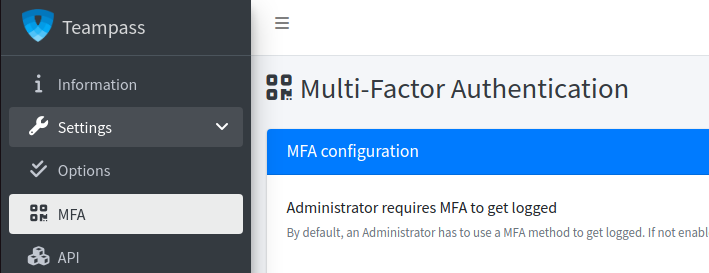
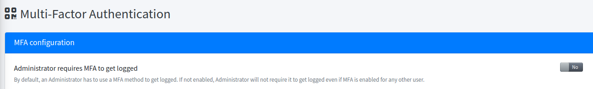
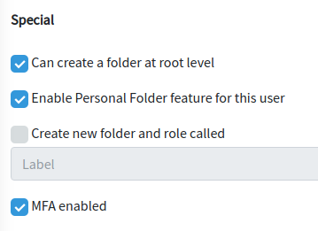
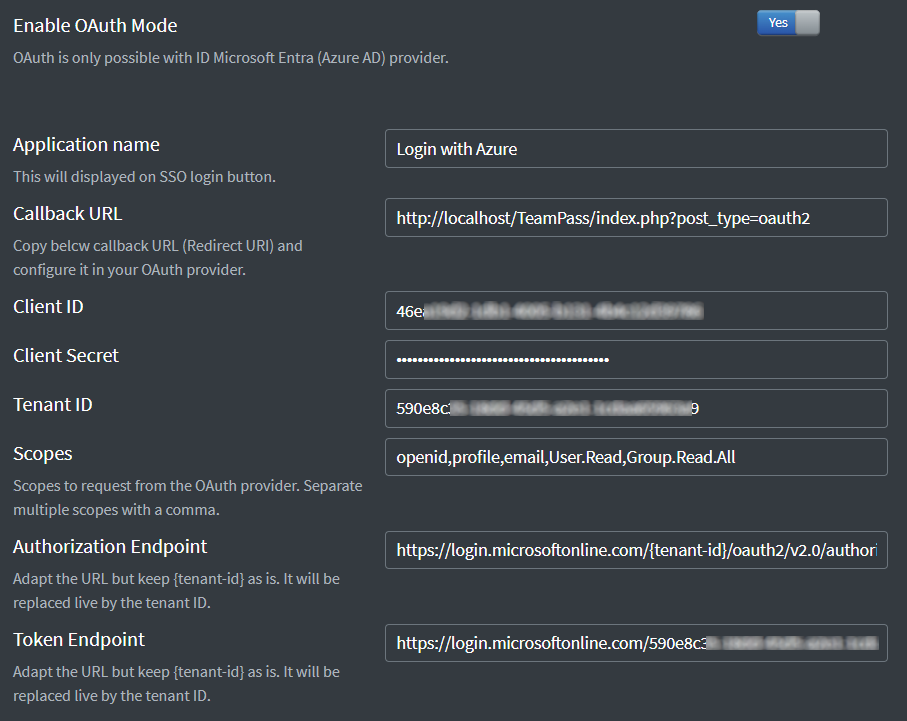

<!-- docs/features/authentication.md -->

## Generalities

Teampass manages users to get them allowed to access items. Each user has an account composed of credentials (login/password).

The authentication step is manage localy in Teampass (by default) or through an AD (through a connection to a remote LDAP server).
In both cases, when a user wants to log into Teampass, the credentials provided are checked compared to the ones in the system.

Keep in mind that the user's password is used also as a key to decrypt his private key. This one is used to uncrypt all data in Teampass related to items.

## LDAP authentication

### Way it works

When LDAP server is set up in Teampass, the authentication of a user credentials is performed on the remote AD server. if the answer is positive then the user is logged in the tool and if not, a warning message is provided.

It has been decided to have a semi-automatic synchronization between the users annuary in Teampass and in the AD remote server. Indeed an administrator must validated what users from the AD remote server will be created inside Teampass. No automatic synchronization is available.
That said, Teampass will offer the possibility to select what users from the AD remote server will be added in Teampass. Once done, the user will be identified as an AD user and his authentication will always be performed versus the AD remote server.

This strategy permits to keep control on users that can access your sensitive items stored in Teampass.
It laso permit to have local users in parallel. That means that those users are not synchronized with the AD remote server.

### Setting up

Teampass manages connections to `Active Directory` and `OpenLDAP` servers.

LDAP in Teampass is handled through [LDAPRecord](https://ldaprecord.com/) library.
It could be usefull to open its [documentation](https://ldaprecord.com/docs/core/v2/configuration) page while performing the setup in Teampass.

#### Configure your LDAP connection

Expected connection configuration keys are :

* __[Hosts](https://ldaprecord.com/docs/core/v2/configuration#hosts)__ - The hosts option is an array of IP addresses or host names located on your network that serve an LDAP directory (seprated by a comma). You insert as many servers or as little as you would like depending on your forest (with the minimum of one of course). 
* __[Base Distinguished Name](https://ldaprecord.com/docs/core/v2/configuration#base-distinguished-name)__ - The root distinguished name (DN) to use when running queries against the directory server. *Examples: o=example,c=com ; cn=users,dc=ad,dc=example,dc=com*
* __[username & password](https://ldaprecord.com/docs/core/v2/configuration#username--password)__ - The distinguished name of the user that the application will use when connecting to the directory server, and his password. *Examples: cn=administrator,cn=users,dc=ad,dc=example,dc=com ; cn=user,dc=domain,dc=name*
* __[Port](https://ldaprecord.com/docs/core/v2/configuration#port)__ - The port option is used for authenticating and binding to your LDAP server. The default ports are already used for non SSL and SSL connections (389 and 636). Only insert a port if your LDAP server uses a unique port. 

Those keys are mandatory as expected in order to open the connection to the AD remote servers.

#### Configure the users attributes

Depending of the AD type and your users annuary configuration, the next keys need to be set up to fit your specific needs.

* __User Distinguished Name__ - The attribute label for the user Distinguished Name (DN) in the AD.
* __User name attribute__ - The attribute field to use when loading the username. The default value in case of an `Active Directory` should be defined as `samaccountname`. In case of `OpenLDAP`, it should be `uid`.
* __Additional User DN__ - This value is used in addition to the base DN when searching and loading users. If no value is supplied, the subtree search will start from the base DN.
* __User Object Filter__ - The filter to use when searching user objects.
* __LDAP group object filter__ - The filter to use when searching group objects.
* __LDAP GUID attribute__ - Provides the GUID attribute used in your directory.Only used when option (1) is enabled.

#### Configure special Teampass characteritics

* __Local and LDAP users__ - If LDAP authentication is enabled, only users synchronized with AD remote server will be allowed to log in Teampass. Locally managed users will by default be rejected. With this option enabled, both kind of users can be allowed to log in Teampass.
* __AD user roles mapped with their AD groups (1)__ - When enabled, Administrator will be able to map existing AD Groups with local Teampass roles. By doing so, any AD user belonging with one of this AD group will automatically be promoted to the mapped Teampass role.
* __Hide forgot password link on Home page__ - If LDAP authentication is enabled, you should disable forgot password feature but it can be enabled for locally managed users.
* __AD user to get created automatically__ - Valid AD user will have an account automatically created in Teampass and his AD groups mapped with corresponding Teampass roles.

## Multi Factor Authentication (MFA)

> User authentication can be completed with an MFA protocol. Currently, `Google Authentication` and `DUO Security` can be enabled for users.

### Setting up

As an Administrator, select the `Settings \ MFA` option in the left menu.

### Generalities

🔔 Once an MFA protocol is enabled, the MFA code is mandatory for each user to get authenticated in Teampass. 2 exceptions are possible.

👉 Administrator users can have this rule disabled globally using dedicated option.

👉 By default, each user has to authenticated with an MFA code. But this can be disabled through the user form inside page `Users` using the input `MFA enabled`.

If disabled for a user, a red fingerprint symbol is shown in the users list.

## Oauth2 with Microsoft Entra (Azure)

Users can authenticate through your Entra AD. The first time a user is authenticate in Teampass through oauth2, his account will be created in Teampass.

👉 Notice that if the user has `group memberships` defined in AD and that those groups also exist in Teampass, then the user will be automatically associated to the matching groups (based upon their names).

### Setting up at Entra side

You need to create a new `App registration` for example called `Teampass`.

This App will have an `Application (client) ID` and a `Directory (tenant) ID`.
A `Client secret` is also expected, not the `Secret ID` but the `Value` (the one that is only seen once).

You will have to define a new `Redirect URIs` with the value provided from Teampass OAuth configuration page.
And it is requested to use option `Accounts in this organizational directory only (Default Directory only - Single tenant)` as `Supported account types`.

Now define `API permissions` with next permissions:

* `Microsoft Graph`:
  * `email` with Type `Delegated`
  * `Group.Read.All` with Type `Delegated`
  * `Group.Read.All` with Type `Application`
  * `offline_access` with Type `Delegated`
  * `openid` with Type `Delegated`
  * `profile` with Type `Delegated`
  * `User.Read` with Type `Delegated`
* `Teampass`:
  * `Read.All` with Type `Delegated`

Don't forget to `Grant admin consent for Default Directory`.

Finaly define the users allowaed to access this new Application

### Setting up in Teampass

Navigate to `OAuth` page from the administration, and provide the expected information.

It is suggested to perform a test with a fake user.

