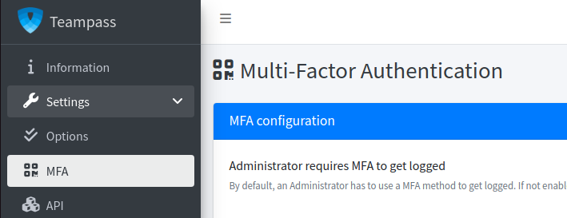
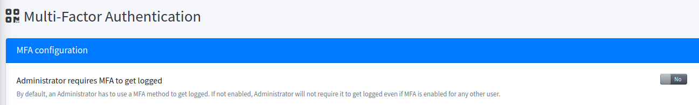
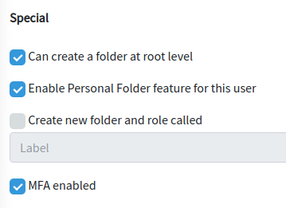
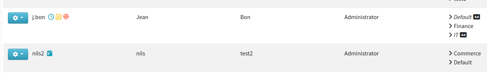
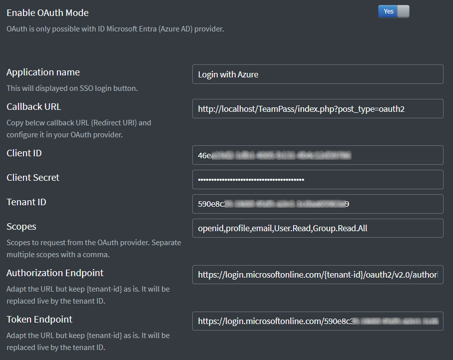

<!-- docs/features/authentication.md -->


## Generalities

Teampass manages users to get them allowed to access items. Each user has an account composed of credentials (login/password).

The authentication step is manage localy in Teampass (by default) or through an AD (through a connection to a remote LDAP server).
In both cases, when a user wants to log into Teampass, the credentials provided are checked compared to the ones in the system.

Keep in mind that the user's password is used also as a key to decrypt his private key. This one is used to uncrypt all data in Teampass related to items.

## LDAP authentication


### Way it works

When LDAP server is set up in Teampass, the authentication of a user credentials is performed on the remote AD server. if the answer is positive then the user is logged in the tool and if not, a warning message is provided.

It has been decided to have a semi-automatic synchronization between the users annuary in Teampass and in the AD remote server. Indeed an administrator must validated what users from the AD remote server will be created inside Teampass. No automatic synchronization is available.
That said, Teampass will offer the possibility to select what users from the AD remote server will be added in Teampass. Once done, the user will be identified as an AD user and his authentication will always be performed versus the AD remote server.

This strategy permits to keep control on users that can access your sensitive items stored in Teampass.
It laso permit to have local users in parallel. That means that those users are not synchronized with the AD remote server.

### Setting up

Teampass manages connections to `Active Directory` and `OpenLDAP` servers.

LDAP in Teampass is handled through [LDAPRecord](https://ldaprecord.com/) library.
It could be usefull to open its [documentation](https://ldaprecord.com/docs/core/v2/configuration) page while performing the setup in Teampass.

#### Configure your LDAP connection

Expected connection configuration keys are :

* __[Hosts](https://ldaprecord.com/docs/core/v2/configuration#hosts)__ - The hosts option is an array of IP addresses or host names located on your network that serve an LDAP directory (seprated by a comma). You insert as many servers or as little as you would like depending on your forest (with the minimum of one of course). 
* __[Base Distinguished Name](https://ldaprecord.com/docs/core/v2/configuration#base-distinguished-name)__ - The root distinguished name (DN) to use when running queries against the directory server. *Examples: o=example,c=com ; cn=users,dc=ad,dc=example,dc=com*
* __[username & password](https://ldaprecord.com/docs/core/v2/configuration#username--password)__ - The distinguished name of the user that the application will use when connecting to the directory server, and his password. *Examples: cn=administrator,cn=users,dc=ad,dc=example,dc=com ; cn=user,dc=domain,dc=name*
* __[Port](https://ldaprecord.com/docs/core/v2/configuration#port)__ - The port option is used for authenticating and binding to your LDAP server. The default ports are already used for non SSL and SSL connections (389 and 636). Only insert a port if your LDAP server uses a unique port. 

Those keys are mandatory as expected in order to open the connection to the AD remote servers.

#### Configure the users attributes

Depending of the AD type and your users annuary configuration, the next keys need to be set up to fit your specific needs.

* __User Distinguished Name__ - The attribute label for the user Distinguished Name (DN) in the AD.
* __User name attribute__ - The attribute field to use when loading the username. The default value in case of an `Active Directory` should be defined as `samaccountname`. In case of `OpenLDAP`, it should be `uid`.
* __Additional User DN__ - This value is used in addition to the base DN when searching and loading users. If no value is supplied, the subtree search will start from the base DN.
* __User Object Filter__ - The filter to use when searching user objects.
* __LDAP group object filter__ - The filter to use when searching group objects.
* __LDAP GUID attribute__ - Provides the GUID attribute used in your directory. Only used when option (1) is enabled.
* __Restrict login to LDAP group (DN)__ - Full distinguished name of the LDAP group whose members are allowed to log in. Leave empty for no restriction. See [Login restriction by group membership](#login-restriction-by-group-membership) for details.

#### Configure special Teampass characteritics

* __Local and LDAP users__ - If LDAP authentication is enabled, only users synchronized with AD remote server will be allowed to log in Teampass. Locally managed users will by default be rejected. With this option enabled, both kind of users can be allowed to log in Teampass.
* __AD user roles mapped with their AD groups (1)__ - When enabled, Administrator will be able to map existing AD Groups with local Teampass roles. By doing so, any AD user belonging with one of this AD group will automatically be promoted to the mapped Teampass role.
* __Hide forgot password link on Home page__ - If LDAP authentication is enabled, you should disable forgot password feature but it can be enabled for locally managed users.
* __AD user to get created automatically__ - Valid AD user will have an account automatically created in Teampass and his AD groups mapped with corresponding Teampass roles.


### Login restriction by group membership

By default, any valid LDAP user can log into Teampass (subject to the *Local and LDAP users* setting). The **Restrict login to LDAP group (DN)** option lets you further narrow access to members of a single specific group.

#### How it works

When a DN is configured, Teampass performs an additional check **after** credential validation: it fetches the group entry directly by its full DN and verifies that the authenticating user is listed as a member. Users who are not members are denied login — and no local account is created for them.

The group entry is retrieved with an LDAP `scope=base` read, which means **the group can be located anywhere in the directory tree**, including outside the users base DN. This is particularly useful in environments where groups and users are stored under different subtrees.

All standard membership attribute types are supported:

| Attribute | Object class |
|-----------|-------------|
| `uniqueMember` | `groupOfUniqueNames` |
| `member` | `groupOfNames` |
| `memberUid` | `posixGroup` |

#### Configuration

In the admin panel, navigate to **Settings › LDAP** and fill in the **Restrict login to LDAP group (DN)** field with the full DN of the group:

```
cn=xa_passman,ou=group,ou=rgy_res,o=desy,c=de
```

Leave the field empty to disable the restriction.

> **Note** — This setting applies to both `OpenLDAP` and `Active Directory` connection types.

#### Error handling

| Situation | Behaviour |
|-----------|-----------|
| User not in the group | Login denied with message *"Access denied: your account is not in the required LDAP group."* |
| Group DN not found (typo) | Login denied; a warning is written to the server error log |
| Field left empty | No restriction applied — existing behaviour unchanged |

---

## Multi Factor Authentication (MFA)

> User authentication can be completed with an MFA protocol. Currently, `Google Authentication` and `DUO Security` can be enabled for users.

### Setting up

As an Administrator, select the `Settings \ MFA` option in the left menu.



### Generalities

🔔 Once an MFA protocol is enabled, the MFA code is mandatory for each user to get authenticated in Teampass. 2 exceptions are possible.

👉 Administrator users can have this rule disabled globally using dedicated option.



👉 By default, each user has to authenticated with an MFA code. But this can be disabled through the user form inside page `Users` using the input `MFA enabled`.



If disabled for a user, a red fingerprint symbol is shown in the users list.



### Google Authenticator enrollment

When `Google Authenticator` is the selected MFA protocol, a user has to enroll their
authenticator app (Google Authenticator, FreeOTP, Authy, etc.) the first time. The flow is:

1. A **temporary code** is sent to the user by e-mail (automatically when MFA is first required,
   or when an administrator generates one — see below).
2. On the login page the user enters their **login**, **password** and this **temporary code**.
3. Once the temporary code is accepted, Teampass displays a **QR code**. The user scans it with
   their authenticator app.
4. The user logs in again, this time entering the **6-digit code** produced by the app.
   Enrollment is complete only at this step.

> **Anti-lockout** — the account is marked as fully enrolled **only after the first valid 6-digit
> code has been verified**, not as soon as the QR code is shown. As long as enrollment is not
> finished, a new QR code can still be issued (login-page link or administrator). A failed or
> missed scan can therefore never leave a user enrolled without a working authenticator.

### QR code generation (offline)

The QR code is built from the standard `otpauth://` provisioning URI and **rendered entirely in
the user's browser**. Teampass does **not** contact any external service (such as
`api.qrserver.com` or the discontinued `chart.googleapis.com`) to draw it.

👉 This means the QR code works on **on-premise and air-gapped servers with no outbound internet
access**. Nothing has to be configured for this — it is the default behaviour.

If the user prefers manual entry, the same secret can be typed into the authenticator app instead
of scanning.

### Resetting a user's Google Authenticator code

If a user changes phone or loses their authenticator, a new code can be issued. Who is allowed to
do this is controlled by the **User can reset his 2FA code** option (`Settings → MFA`):

| `User can reset his 2FA code` | Behaviour |
|---|---|
| **Enabled** | The user can request a new code themselves, using the dedicated link on the login page. |
| **Disabled** (default) | The user **cannot** reset their own code. They see the message *"Your administrator has disabled self-reset of the 2FA code. Please ask them to send you a new code."* and must contact an administrator. |

**Administrator reset** — from the `Users` page, select the user and use the action that sends a
Google Authenticator code by e-mail. This **always works**, regardless of the *User can reset his
2FA code* option, and puts the user back at step 1 of the enrollment flow above.

### Troubleshooting

| Symptom | Cause / resolution |
|---|---|
| The QR code does not appear (not even a broken image) | Make sure the page fully loaded; do a hard refresh (the QR library is served with a version query string). The QR is generated locally, so no internet access is required. |
| *"Your administrator has disabled self-reset of the 2FA code…"* | The **User can reset his 2FA code** option is disabled. Ask an administrator to send a new code, or enable the option in `Settings → MFA`. |
| A user is enrolled but has no working code | An administrator must reset the user's code from the `Users` page (see above). |


## Oauth2 with Microsoft Entra (Azure)

Users can authenticate through your Entra AD. The first time a user is authenticate in Teampass through oauth2, his account will be created in Teampass.

👉 Notice that if the user has `group memberships` defined in AD and that those groups also exist in Teampass, then the user will be automatically associated to the matching groups (based upon their names).

### Setting up at Entra side

You need to create a new `App registration` for example called `Teampass`.

This App will have an `Application (client) ID` and a `Directory (tenant) ID`.
A `Client secret` is also expected, not the `Secret ID` but the `Value` (the one that is only seen once).

You will have to define a new `Redirect URIs` with the value provided from Teampass OAuth configuration page.
And it is requested to use option `Accounts in this organizational directory only (Default Directory only - Single tenant)` as `Supported account types`.

Now define `API permissions` with next permissions:

* `Microsoft Graph`:
  * `email` with Type `Delegated`
  * `Group.Read.All` with Type `Delegated`
  * `Group.Read.All` with Type `Application`
  * `offline_access` with Type `Delegated`
  * `openid` with Type `Delegated`
  * `profile` with Type `Delegated`
  * `User.Read` with Type `Delegated`
* `Teampass`:
  * `Read.All` with Type `Delegated`

Don't forget to `Grant admin consent for Default Directory`.

Finaly define the users allowaed to access this new Application

### Setting up in Teampass

Navigate to `OAuth` page from the administration, and provide the expected information.

It is suggested to perform a test with a fake user.



### Allowing OAuth2 users to access the API

By default OAuth2 (SSO) users **cannot** use the REST API or the browser extension. The API
authenticates a user with their login, password and API key, but an OAuth2 user never sets a
TeamPass password — so the password-based path cannot work for them.

To enable API access for OAuth2 users, turn on **`Allow OAuth2 users to access the API`** on the
`OAuth` administration page. This toggle is **disabled by default** and is independent from the
global API switch on the `API` page: both must be enabled.

Local and LDAP users are not affected — they keep authenticating the API with their password and
API key.

#### How an OAuth2 user connects the API / browser extension

1. The OAuth2 user logs into the TeamPass web interface as usual (through Entra).
2. In **Profile → Browser extension tokens**, they click *Generate a new token*. A 256-bit
   **Personal Access Token** is shown **once** — they copy it immediately (it is never displayed
   again).
3. In the API client / browser extension they authenticate with their **login** and this
   **token** (no password, no API key). The server returns the same kind of session as the
   password path.
4. Tokens can be **revoked** at any time from the same profile screen; a revoked token stops
   working immediately.

Security: the server never stores the token itself — only a hash of it, plus a copy of the user's
private key re-wrapped with a key derived from the token. A database dump alone therefore cannot
decrypt anything, and the token can only be created while the user is fully authenticated in the
web interface.