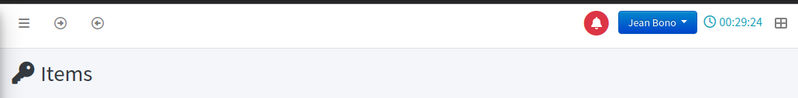
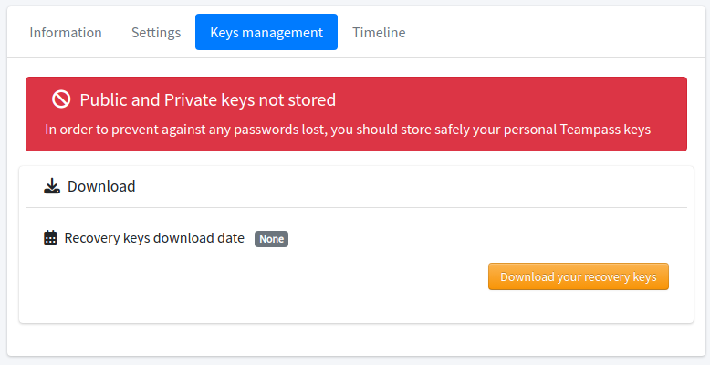
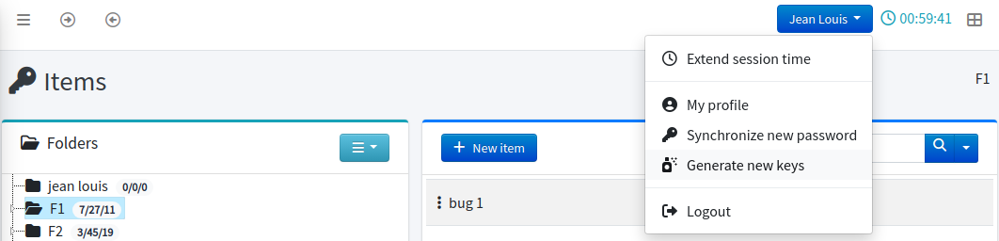
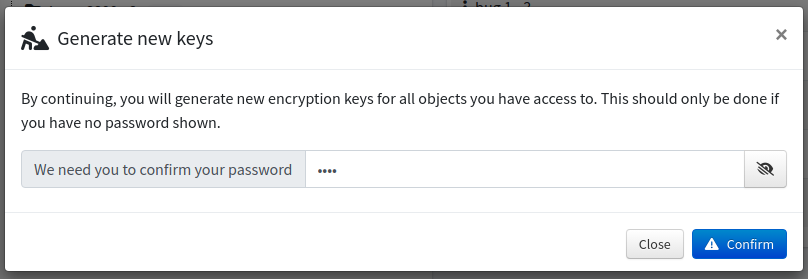

<!-- docs/features/keys.md -->

> 🚧 Under construction

## Generalities

In Teampass, all encrypted elements (such as passwords and encrypted fields) have a unique key for each user. 
This key is encrypted with his/hers login password.
Such a process ensures a high level of security for all data stored in the database through Teampass.

💡 [Read more](../install/encryption.md) about this encryption process.

## Store your recovery keys

For any reason, if your data becomes corrupted, it is requested to recover your personal data using your `recovery keys`.

When user gets logged in, if the recovery keys has never been downloaded, a warning icon is shown at the left of top user menu button.

By clicking the red bell icon, you will be redirected to your profile page where you will be able to download your recovery keys.

Now click button `Download your recovery keys` and __store the generated file in a safe place__!

> ⛔ Without those keys, your personal items password would be lost if you need to regenerate your keys.

## Regenerate your keys (as a User)

For any reason, if you notice that while browsing Teampass's objects, all related passwords are empty then it might be a corruption of your private key is corrupted.
Could be after several login password changes.

For regenerated all your keys, just follow the next instructions.

1. Select entry `Generate new keys` in personal menu
   

2. Ensure that the form contains your login password, and that you have copied the public and private keys

   > 💡 Regenerating the items keys is possible without the public and private recovery keys. You will need to tick the checkbox.
   > Remember that without them, your personal items password would be lost.

   

3. Click `Confirm` button

4. Once started, the process will run in background during several minutes. You can still use Teampass but all the passwords will be blank.
On top of screen, an orange box will show you the process progress. Once finished, you will have your passwords back.
   

> 💡 During this process, you can change page and even leave Teampass.