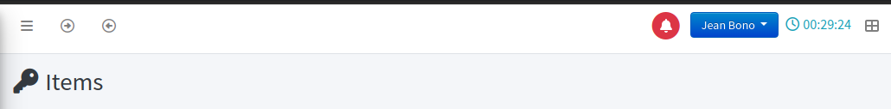
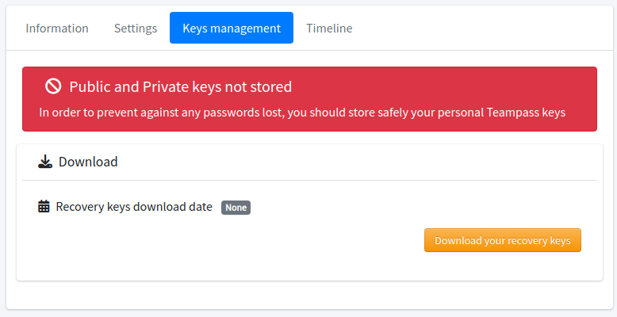
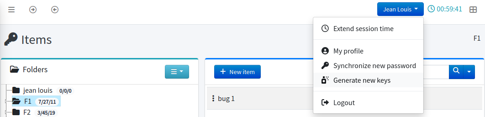
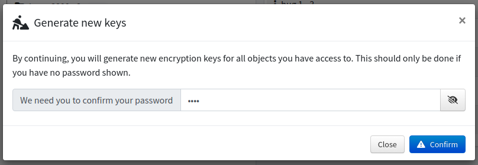

<!-- docs/features/keys.md -->

> 🚧 Under construction

## Generalities

In Teampass, all encrypted elements (such as passwords and encrypted fields) have a unique key for each user. 
This key is encrypted with his/hers login password.
Such a process ensures a high level of security for all data stored in the database through Teampass.

💡 [Read more](../install/encryption.md) about this encryption process.

## Store your recovery keys

For any reason, if your data becomes corrupted, it is requested to recover your personal data using your `recovery keys`.

When user gets logged in, if the recovery keys has never been downloaded, a warning icon is shown at the left of top user menu button.

By clicking the red bell icon, you will be redirected to your profile page where you will be able to download your recovery keys.

Now click button `Download your recovery keys` and __store the generated file in a safe place__!

> ⛔ Without those keys, your personal items password would be lost if you need to regenerate your keys.

## Regenerate your keys (as a User)

For any reason, if you notice that while browsing Teampass's objects, all related passwords are empty then it might be a corruption of your private key is corrupted.
Could be after several login password changes.

For regenerated all your keys, just follow the next instructions.

1. Select entry `Generate new keys` in personal menu
   

2. Ensure that the form contains your login password, and that you have copied the public and private keys

   > 💡 Regenerating the items keys is possible without the public and private recovery keys. You will need to tick the checkbox.
   > Remember that without them, your personal items password would be lost.

   

3. Click `Confirm` button

4. Once started, the process will run in background during several minutes. You can still use Teampass but all the passwords will be blank.
On top of screen, an orange box will show you the process progress. Once finished, you will have your passwords back.
   

> 💡 During this process, you can change page and even leave Teampass.

---

## Local password recovery

> This feature must be enabled by an administrator (`enable_local_password_recovery` setting).

Local password recovery allows a user to regain access to their account through the **Forgot password** link on the login page, without contacting an administrator.

### How it works

When a user sets or changes their login password, Teampass derives a recovery key from that password using PBKDF2. If the user later forgets their password, the recovery flow uses this derivation to reconstruct the private key and restore access.

> 🔔 Local password recovery is only available if the user's private key was successfully derived when the password was last set. If the key was never derived (e.g. for accounts created before this feature was enabled), the recovery link may not be available.

### Enabling local password recovery (admin)

1. Go to **Admin → Settings → Security**.
2. Enable **Enable local password recovery**.
3. Optionally adjust the **PBKDF2 iterations** setting (higher values increase key derivation cost; default is suitable for most deployments).
4. Click **Save**.

Once enabled, the **Forgot password?** link is shown on the login page for standard accounts. LDAP and OAuth2 accounts are excluded — password changes for those accounts must go through the identity provider.