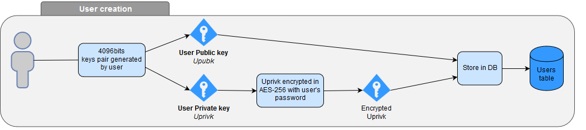
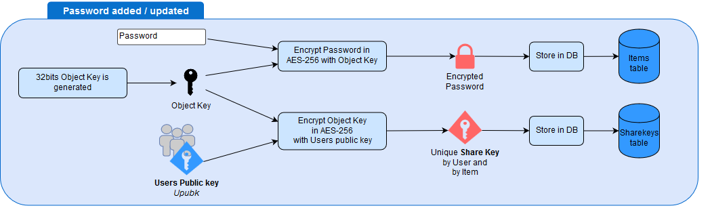
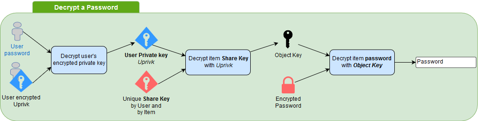

<!-- docs/install/encryption.md -->

## Client-Server exchanges

Exchanges between Client and Server are encrypted through AES counter (CTR) mode proposed by Chris Veness.
Encryption relies on a random key generated when user starts his session.
The key size used is 256 bits.

## User credentials

User credentails are stored encrypted in the database. The encryption is performed using Blowfish algorithm through [PHPPasswordLib library](https://github.com/ircmaxell/PHP-PasswordLib).

## Data encryption

Teampass encrypts sensitive data and especially password part of any defined item. 

The encryption relies on public and private keys each user has. When a user is added, his keys are generated following the next process.

Each encrypted element (password, custom fields) has one shared key by user. This key can only be decrypted with one user Password and Private key.

When a user has to visualize an encrypted element, his password and private key is mandatory
