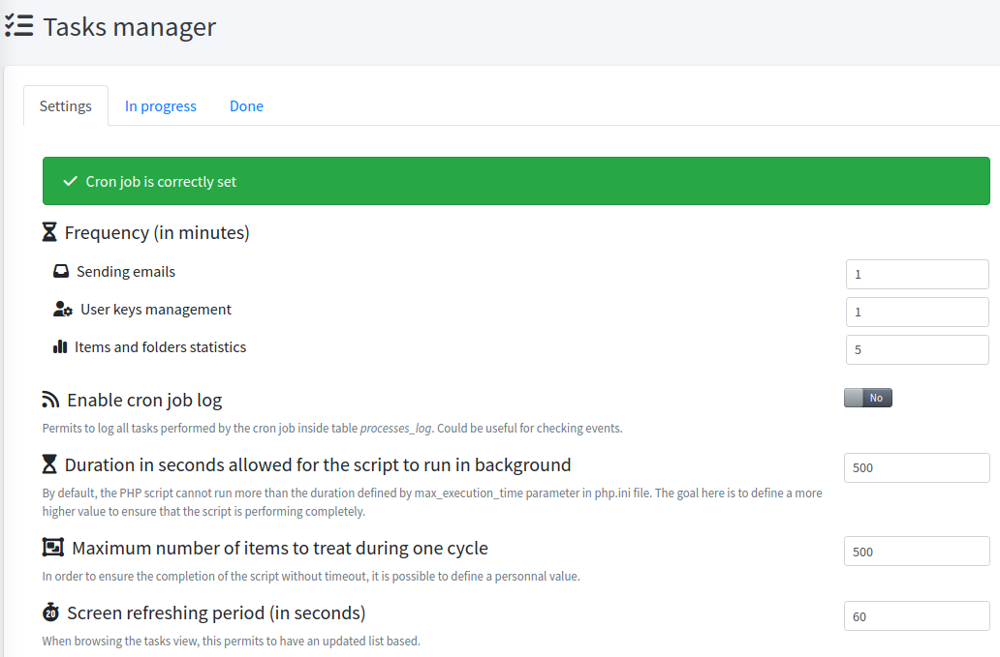

<!-- docs/manage/tasks.md -->

## Generalities

> Permits to handle heavy treatment using background server jobs. 

It is by default enabled and mandatory for Teampass usage.

## Options

> You should use the options to set up the tasks management to fit your PHP server configuration.

As an administrator, open Menu option `Tasks` and select tab `Settings`.

1. Define the task frequencies for sending emails, managing user keys and performing statistics (used in the tree view).
2. Set the maximum duration a script can execute in background. 
_It is suggested to define a higher value that the `max_execution_time` defined in `php.ini` file. Value `0` indicates that any time for the script is allowed._ 
3. Set the number of items will be treated by the script.
_This value is to adapt depending on what happen. But you should not change it._
4. Set the delay after which the data is refreshed in the tasks management follow up page.

## Setting up the cron job

To be enabled, it is required to add a new entry inside the crontab.
Only one entry is expected, each job has its own execution frequency.

First you need to get the location to php (you can run `locate php`).

Notice that during installation, the server crontab is updated with the next job.
More details may be found on how this works by reading [CrontabManager documentation](https://github.com/TiBeN/CrontabManager).

Then open the crons manager with the same user as the one used by php (example: `crontab -u www-data -e`)
and add the input permitting the job to run each 5 minutes for example.
``* * * * * /path/to/phpbin /path/to/Teampass/sources/scheduler.php``

It is mandatory to define it to run every minute.

## Tasks management follow up page

> This page permits to:
> * define the job execution frequency,
> * follow on-going task execution,
> * get track of all tasks being performed in time.

Navigate to `Tasks` and select tab `In progress`.

