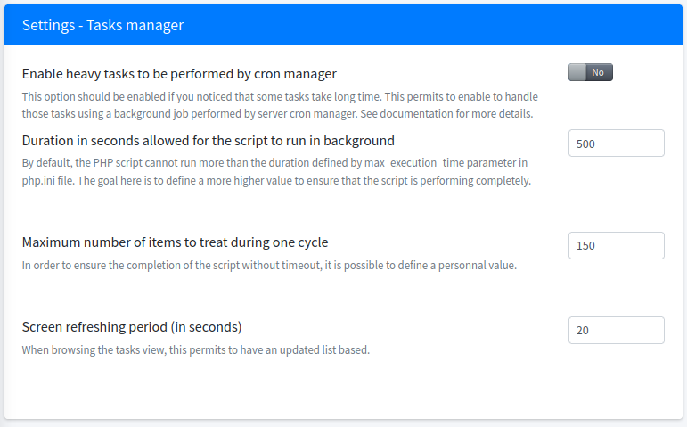

<!-- docs/settings.md -->

## Generalities

## Tasks

> Permits to handle heavy treatment using background server jobs. 

This option should be considered as a good practice and should be enabled.
Currently implemented in case of:
* new user creation (keys encryption step)
* email sending (except immediate emails)

Notice that when not enabled, emails are sent on page browsing which could lead to latencies for your users.

### Options

> You should use the options to set up the tasks management to fit your PHP server configuration.

Navigate to `Administration > Settings > Options`.

1. Set the maximum duration a script can execute in background. 
_It is suggested to define a higher value that the `max_execution_time` defined in `php.ini` file. Value `0` indicates that any time for the script is allowed._ 
2. Set the number of items will be treated by the script.
_This value is to adapt depending on what happen. But you should not change it._
3. Set the delay after which the data is refreshed in the tasks management follow up page.

### Setting up the cron job

To be enabled, it is required to add a new entry inside the crontab.
Only one entry is expected, each job has its own execution frequency.

First you need to get the location to php (you can run `locate php`).

Then open the crons manager (`crontab -e`)
and add the input permitting the job to run each 5 minutes for example.
``* * * * * /path/to/phpbin /path/to/Teampass/sources/scheduler.php  1>> /dev/null 2>&1``

It is mandatory to define it to run every minute.

### Tasks management follow up page

> This page permits to:
> * define the job execution frequency,
> * follow on-going task execution,
> * get track of all tasks being performed in time.

Navigate to `Administration > Tasks`.

