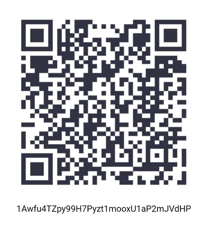

forceutf8
=========

PHP Class Encoding featuring popular \ForceUTF8\Encoding::toUTF8() function --formerly known as forceUTF8()-- that fixes mixed encoded strings.

Description
===========

If you apply the PHP function utf8_encode() to an already-UTF8 string it will return a garbled UTF8 string.

This class addresses this issue and provides a handy static function called \ForceUTF8\Encoding::toUTF8().

You don't need to know what the encoding of your strings is. It can be Latin1 (ISO 8859-1), Windows-1252 or UTF8, or the string can have a mix of them. \ForceUTF8\Encoding::toUTF8() will convert everything to UTF8.

Sometimes you have to deal with services that are unreliable in terms of encoding, possibly mixing UTF8 and Latin1 in the same string.

Update:

I've included another function, \ForceUTF8\Encoding::fixUTF8(), which will fix the double (or multiple) encoded UTF8 string that looks garbled.

Usage:
======

    use \ForceUTF8\Encoding;

    $utf8_string = Encoding::toUTF8($utf8_or_latin1_or_mixed_string);

    $latin1_string = Encoding::toLatin1($utf8_or_latin1_or_mixed_string);

also:

    $utf8_string = Encoding::fixUTF8($garbled_utf8_string);

Examples:

    use \ForceUTF8\Encoding;

    echo Encoding::fixUTF8("Fédération Camerounaise de Football\n");
    echo Encoding::fixUTF8("Fédération Camerounaise de Football\n");
    echo Encoding::fixUTF8("Fédération Camerounaise de Football\n");
    echo Encoding::fixUTF8("Fédération Camerounaise de Football\n");

will output:

    Fédération Camerounaise de Football
    Fédération Camerounaise de Football
    Fédération Camerounaise de Football
    Fédération Camerounaise de Football
    
Options:
========
By default, `Encoding::fixUTF8` will use the `Encoding::WITHOUT_ICONV` flag, signalling that iconv should not be used to fix garbled UTF8 strings.

This class also provides options for iconv processing, such as `Encoding::ICONV_TRANSLIT` and `Encoding::ICONV_IGNORE` to enable these flags when the iconv class is utilized. The functionality of such flags are documented in the [PHP iconv documentation](http://php.net/manual/en/function.iconv.php).

Examples:

    use \ForceUTF8\Encoding;
    
    $str = "Fédération Camerounaise—de—Football\n"; // Uses U+2014 which is invalid ISO8859-1 but exists in Win1252
    echo Encoding::fixUTF8($str); // Will break U+2014
    echo Encoding::fixUTF8($str, Encoding::ICONV_IGNORE); // Will preserve U+2014
    echo Encoding::fixUTF8($str, Encoding::ICONV_TRANSLIT); // Will preserve U+2014

will output:

    Fédération Camerounaise?de?Football
    Fédération Camerounaise—de—Football
    Fédération Camerounaise—de—Football

while:

    use \ForceUTF8\Encoding;

    $str = "čęėįšųūž"; // Uses several characters not present in ISO8859-1 / Win1252
    echo Encoding::fixUTF8($str); // Will break invalid characters
    echo Encoding::fixUTF8($str, Encoding::ICONV_IGNORE); // Will remove invalid characters, keep those present in Win1252
    echo Encoding::fixUTF8($str, Encoding::ICONV_TRANSLIT); // Will trasliterate invalid characters, keep those present in Win1252

will output:

    ????????
    šž
    ceeišuuž


Install via composer:
=====================
Edit your composer.json file to include the following:

```json
{
    "require": {
        "neitanod/forceutf8": "~2.0"
    }
}
```

Tips:
=====
You can tip me with Bitcoin if you want. :)


